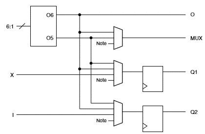
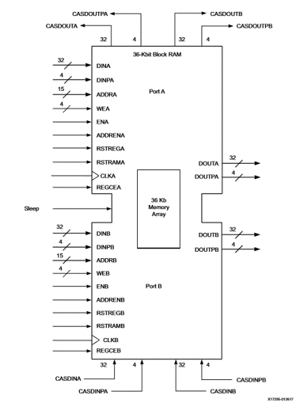
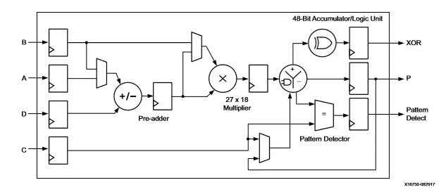

## Table of contents

## 1 模拟电路和数字电路

模拟电路处理的是模拟信号：在时间和数量上的变化是连续的，如温度；

数字电路处理的是数字信号：在时间和数量上的变化是离散的，如人数；

大规模和超大规模集成电路都是数字电路。

## 2 什么是可编程逻辑器件

可编程逻辑器件（*Programmable Logic Device, PLD*）：允许用户自信修改内部连接的集成电路，即 PLD 内部的电路结构可以通过编程来改变。

常见的 PLD 有可编程逻辑器件（*CPLD*）和现场可编程门阵列（*FPGA*），CPLD 是基于**乘积项**的与或逻辑阵列，FPGA 是基于**查找表**的逻辑门 CLB 阵列。

## 3 什么是 FPGA

现场可编程门阵列（*FPGA*）是一种可以通过编程来修改逻辑值的数字集成电路（芯片），不同于 *ASIC* 芯片，它是一个半成品集成电路，允许开发者进行无限次数的电路改写，大大降低了电子产品原型开发周期和成本。

相比于CPU和GPU，FPGA的主频很低，通常在100-200MHz。最新的FPGA可以运行在300MHz以上，但也很难超过400MHz。因此单纯就运算速度而言，基于FPGA的硬件设计必须有足够的并行度或其他优化手段才可以和CPU以及GPU匹敌。

相对于通用计算平台，FPGA的硬件设计冗余更小，提供相同的功能，只需要很低的功耗。低端的FPGA的功耗可以在5W以内，而高端的FPGA通常也不会超过100W。

> 注意：区分FPGA板卡和FPGA芯片，以及它们的型号，不要混用。

### 3.1 FPGA 内部结构
FPGA内部由一些相同的“块”构成，每个块内部又包含不同的列，每一列内部包含一种逻辑单元。逻辑单元之间通过互连线以及开关提供任意的连接方式。现代的FPGA主要由以下几种逻辑单元构成：

1. 查找表和寄存器 (LUT & register)
通常，查找表和寄存器会绑定在一起，任何组合逻辑都可以通过真值表的方式来实现。因此将真值表烧写到RAM中作为查找表是一种通用的实现逻辑的方式。

Xilinx的FPGA中通常采用6输入1输出（可配置为5输入2输出）的查找表作为基本的单元。对于需要更多输入的逻辑，可以采用查找表级联的形式来实现。查找表后面通常会级联寄存器，将组合逻辑的输出及时地寄存，以保证电路的整体性能。

在Xilinx的FPGA中，查找表和寄存器的比例通常是1:2。在不使用寄存器进行大量的数据存储时，通常寄存器的资源是足够的。而需要存储数据时，也可以将查找表配置为RAM来使用。FPGA中的LUT数量在几万到几十万不等，仅作为存储也有不小的规模。

2. 缓存 (Block RAM)

缓存(Block RAM)是FPGA中最重要的存储单元，通常用BRAM来简称。最新的FPGA可包含接近100MB的BRAM，远远超过一般的CPU或GPU的cache大小。FPGA中的缓存通常是真双端口(true dual port)缓存，包含两组读写口，每一组端口可以时分复用地读或写。

FPGA中的缓存通常为统一大小的块。Xilinx的缓存的基本粒度为36bit宽，深度为512，视为0.5个BRAM。实际使用时可以根据需要配置成更窄的位宽以及更大的深度。当设计使用的缓存大小超过0.5个BRAM时，综合工具会自动将其映射到多个BRAM上。最新的Xilinx FPGA还包含了72-bit宽，深度为4096的Ultra RAM来针对大容量片上存储的需求。

3. 数字处理单元 (DSP)

数字处理单元(DSP)是用来进行整数的数学运算的。其基本的功能包括整数的加法、累加、乘法等。可以以流水线的形式完成完成`(A+D)*B+C`的功能。下图Xilinx的FPGA中DSP的基本结构。

尽管这样的功能也可以用查找表和寄存器来实现，但是采用DSP单元，在面积与时序上都会更优。一些其他功能的IP，例如浮点计算的IP，也会尽可能借助DSP单元来实现功能。

## 4 FPGA 与 CPU 的区别

FPGA 与 CPU 的区别在于：
1. 是否改变硬件内部结构：FPGA 编程是通过改变硬件电路的连接方式来完成任务的，而 CPU 的编程并不改变内部的连接结构。
2. 是否并行：CPU 需要进行取指，译码，执行的过程，这个过程是串行的；FPGA 是并行的，处理速度比 CPU 快得多。

目前很多的FPGA，如Xilinx的Zynq 7000和UltraScale MPSoC以及Versal系列，都在芯片上集成了ARM架构的CPU。

一方面基于CPU可以快速搭建DEMO。另一方面，一些不利于FPGA实现的功能可以在片上集成的CPU上实现，两者形成互补，为方案设计提供更大的选择空间。

Xilinx的术语中，通常将SoC中的CPU称为PS（*Processing System*），将FPGA部分称为PL（*Programmable Logic*）。

## 5 什么是 Verilog

`Verilog`是用于设计 FPGA 电路的一门语言，可以用类C语言风格编写电路设计代码，然后使用 FPGA 厂商提供的工具链进行综合，仿真，模拟，最后生成可以在FPGA上面运行的电路。

## 6 FPGA 开发流程

1. 设计文档：明确功能、资源需求、模块划分。
2. 逻辑设计：使用硬件描述语言（*HDL*）在不同的层次对数字电路的结构，功能和行为进行描述。
3. 电路实现：通过综合工具，将HDL所描述的电路转换为门级电路网表，然后将其与某种工艺的基本原件一一对应起来，最后通过布局布线工具转换为电路布线借结构。
4. 系统验证：使用仿真工具或者现场调试工具进行功能和正确性的验证。

## 参考资料

- [simple-fpga-guide | Github](https://github.com/GkyHub/simple-fpga-guide/blob/master/doc/fpga_intro.md)
- [verilog-notes | Github](https://github.com/lyp365859350/Verilog/blob/master/Notes.md)