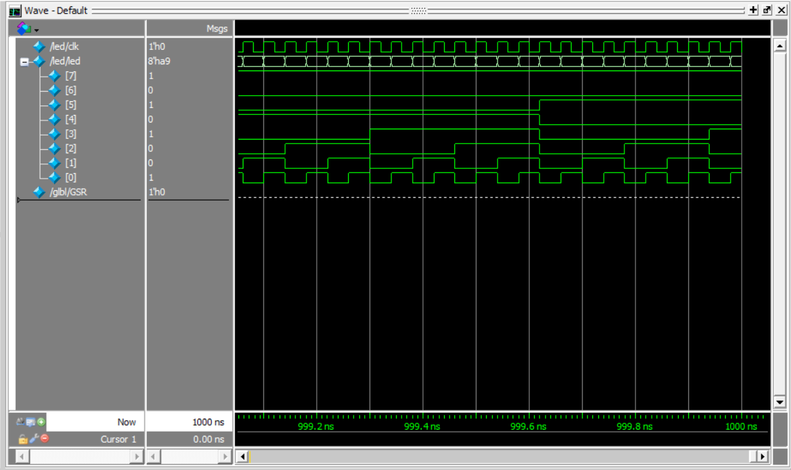

## Table of contents


## 1 软件介绍

### 1.1 Vivado

Vivado是赛灵思（Xilinx）公司推出的一款集成化的FPGA设计工具套件，用于帮助工程师进行FPGA设计、验证和实现。Vivado提供了丰富的功能和工具，包括逻辑设计、综合、时序分析、布局布线、仿真等，可以帮助工程师快速、高效地完成FPGA设计工作。

Vivado支持多种Xilinx FPGA系列，包括Artix、Kintex、Virtex等，同时也支持高级综合（HLS）工具，使得工程师可以更方便地进行高层次的设计和优化。Vivado是一个强大而全面的FPGA设计工具，被广泛应用于通信、嵌入式系统、图像处理等领域。


### 1.2 Modelsim

Modelsim是Mentor公司开发的优秀的HDL语言仿真软件。它能提供友好的仿真环境，采用单内核支持VHDL和Verilog混合仿真的仿真器。它采用直接优化的编译技术、Tcl/Tk技术和单一内核仿真技术，编译仿真速度快且编译的代码与平台无关。

ModelSim有几种不同的版本：SE、PE、LE和OEM，其中SE是最高级的版本，而集成在 Actel、Atmel、Altera、Xilinx以及Lattice等FPGA厂商设计工具中的均是其OEM版本。


### 1.3 软件包

> 软件下载：
> 1. [Vivado | Xilinx](https://www.xilinx.com/products/tools/vivado.html)
> 2. [Vivado | Quark](https://pan.quark.cn/s/01996b0b2e69)
> 2. [Modelsim (free version)](https://www.intel.com/content/www/us/en/collections/products/fpga/software/downloads.html?edition=pro&platform=windows&download_manager=direct&product=modelsim_ae)
> 3. [Modelsim (Password: 82eh) | BaiduPan](https://pan.baidu.com/s/1vaMfrHw4IfamREKiVAsSGw)


## 2 仿真配置

需要下载软件并配置 Modelsim 与 Vivado之间的仿真库，详情见参考资料。


## 3 首个例程

在新建的工程中，创建`led.v`文件，写入并`Run Simulation`：


```verilog

// led.v
module led();

    reg clk;       // 时钟信号
    reg [7:0] led; // LED灯信号

    // 时钟信号生成，时钟频率为100MHz
    always begin
        #0.02 clk = ~clk; // 时钟周期为0.02us，即50MHz
    end

    // 初始化
    initial begin
        clk = 0;
        led = 8'b00000001;

        // 模拟100个时钟周期
        repeat (100) begin
        #500; // 等待一个时钟周期
        end

        $finish; // 结束仿真
    end

    // LED灯控制逻辑
    always @(posedge clk) begin
        led <= led + 1; // 每个时钟周期LED灯状态加一
    end

endmodule

```

可以在 Modelsim 中见到该例程的波形图：




## 参考文献

- [最详细的 Vivado 安装教程 | CSDN](https://blog.csdn.net/weixin_49457347/article/details/123643998)
- [Modelsim 安装步骤详解 | CSDN](https://blog.csdn.net/QWERTYzxw/article/details/115350715)
- [FPGA开发软件环境搭建 | Zhihu](https://zhuanlan.zhihu.com/p/605742464)
- [Vivado开发FPGA使用流程 | CSDN](https://blog.csdn.net/weixin_45676874/article/details/132215573)
- [Modelsim 与 Vivado 版本号 | BokeYuan](https://www.cnblogs.com/devindd/articles/16837346.html)