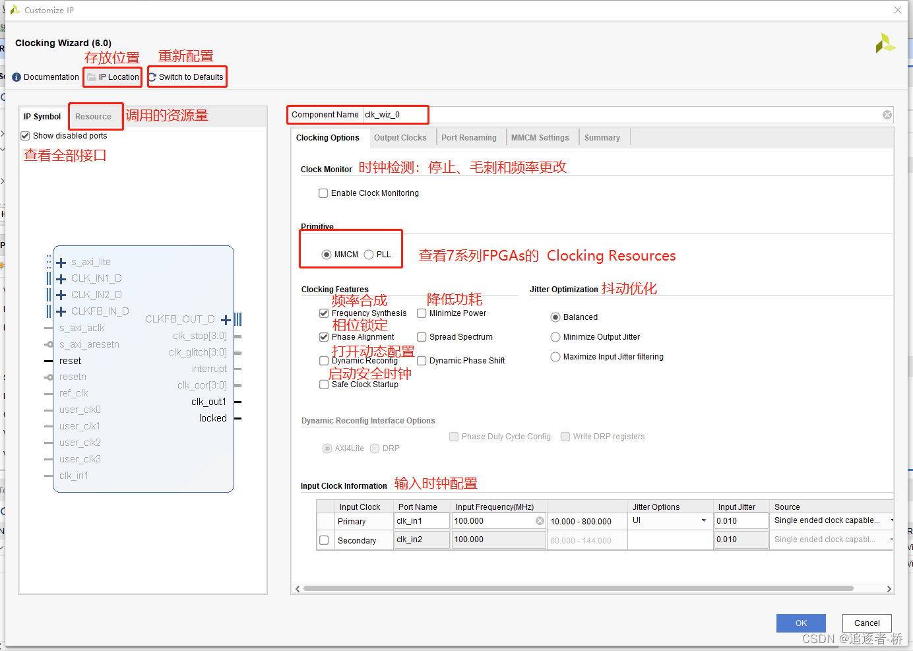
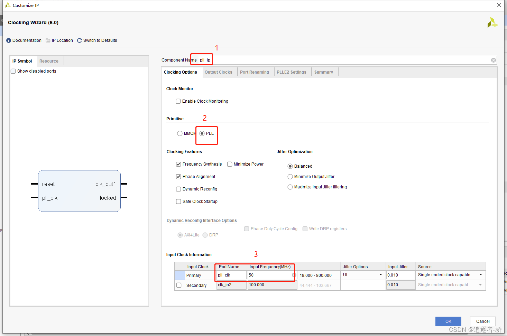

## Table of contents

## 1 IP 核介绍

在 ASIC 或 FPGA 中，IP （*Intellectual Property*）被定义为**预先设计好的电路功能模块**。IP 核在数字电路中常用于设计参数可修改、功能比较复杂的模块（如：ROM、RAM、FIR滤波器、SDRAM控制器、PCIE接口等），其他用户可以直接调用这些模块。

对着设计规模的增大，复杂度提高，使用 IP 核设计电子系统方便引用、修改元器件功能，从而提高开发效率。

IP 核根据产品交付的方式，分为如下三种：
1. **软核**：HDL（*Hardware Description Language*）硬件描述语言所编写的模块，可进行参数调整、复用性强，布线、布局灵活，设计周期短、投入少；
2. **固核**：一般为网表形式，是完成了综合的模块，可以预布线特定信号或分配特定的布线资源；
3. **硬核**：一般为版图形式，是完成提供设计最终阶段产品——掩膜（Mask），缺乏灵活性、可移植性，易于实现对 IP 核的保护。

> 注意：
> IP 核往往不能跨平台使用，IP 核不透明，看不到内部核心代码，其次，定制 IP 核一般需要额外收费。


## 2 常用 IP 核

在不同应用场景下，生成工具提供如下类别的 IP 核：
1. **数学运算模块**：包括累加器、乘加器、乘累加器、计数器、加/减法器、实/复数乘法器、除法器、CORDIC 算法器、DSP48 宏和浮点数操作器；
2. **存储器构造模块**：包括块存储器和分布式存储器、先入先出存储器（FIFO）和移位寄存器；
3. **DSP 功能**：包括直接数字频率合成（DDS）编译器、数字上变频/下变频（DUC/DDC）编译器、有限冲激响应（FIR）滤波器、级联积分梳状（CIC）滤波器、离散傅里叶变换（DFT）和快速傅里叶变换（FFT）；
4. **信道纠错码**：包括 RS 码编码器和译码器、卷积码编码器、Viterbi 译码器、Turbo码编/译码器和低密度奇偶校验码（LDPC）编码器等；
5. **网络应用**：**包括媒体访问控制器（MAC）、以太网物理编码子层/物理介质连接(PCS/PMA)、网络负载统计、以太网拓展连接单元接口（XAUI）、减少引脚使用的XAUI（RXAUI）、MAC 封装包和音/视频桥接（AVB）端点；
6. **FPGA 结构属性**：**包括时钟向导、高速串行收发器（GTX/GTP）和系统监视向导；
7. **连接器**：包括标准总线接口（如 PCI/PCI-X、PCI Express、CAN）和数据接口（如以太网、RapidIO 等）；
8. **调试和验证**：包括逻辑调试内核（集成控制器核（ICON）、集成逻辑分析核（ILA）、虚拟输入/输出核（VIO）、Agilent 跟踪核（ATC2）、误比特率测试核（IBERT）和集成总线分析核（IBA）；
9. **针对不同设计方法的特殊IP核**：包括用工程导航工具进行逻辑设计的IP核、用Xilinx系统生成工具进行DSP算法设计的IP核，以及用Xilinx平台开发环境（XPS）或 PlanAhead进行嵌入式设计的IP核；

本章将重点介绍几个常用的 IP，如PLL、FIFO、RAM、ROM 等，详细说明各 IP 核的功能以及其使用方法，通过使用这些简单的 IP 核来掌握所有 IP 核的基本使用方法，起到抛砖引玉的效果。


### 2.1 锁相环 PLL

**锁相环** PLL（*Phase Locked Loop*）是最常用 IP 核的一种。其性能强大，可以对输入到 FPGA 的时钟信号进行任意分频、倍频、相位调整、占空比调整，从而输出一个期望时钟。许多电子设备要正常工作，通常需要外部的输入信号与内部的振荡信号同步，利用锁相环就可以实现这个目的。

实际上，即使不想改变输入到 FPGA 时钟的任何参数，也常常会使用 PLL，因为经过 PLL 后的时钟在抖动（*Jitter*）方面的性能更好一些。

Xilinx 中的 PLL 是**模拟锁相环**，和数字锁相环不同的是模拟锁相环的优点是输出的稳定度高、相位连续可调、延时连续可调；缺点是当温度过高或者电磁辐射过强时会失锁（普通环境下不考虑该问题）。

> 注意：
> 抖动（Jitter）是指时钟信号波形在时间轴上的不稳定性，即时钟信号的周期性变化或者相位变化。抖动可以导致系统性能下降，特别是在高速通信或者精密测量系统中会产生负面影响。
> 失锁（Lose Lock）是指锁相环（PLL）失去了对输入时钟信号的锁定，无法正确输出期望的时钟信号。失锁可能是由于输入时钟信号的频率或者相位发生了变化，或者是由于PLL本身的故障导致的。失锁会导致系统时钟不稳定，对系统的正常运行造成影响。

**锁相环**通常由鉴相器（*PD,Phase Detector*）、环路滤波器（*LF,Loop Filter*）和压控振荡器（*VCO,Voltage Controlled Oscillator*）三部分组成：

```
             <ref_clk>
                |
        +---> [FD/PD]
        |       |
        |      <uD>
        |       |
        |      [LF]
        |       |
        |      <uC>
        |       |
        +----- [VCO]
                |
             <pll_out>

```


1. 参考时钟（ref_clk）通过鉴频（FD）鉴相器（PD）和需要比较的时钟频率进行比较，我们以频率调整为例，如果参考时钟频率等于需要比较的时钟频率则鉴频鉴相器输出为 0，如果参考时钟频率大于需要比较的时钟频率则鉴频鉴相器输出一个变大的成正比的值，如果参考时钟频率小于需要比较的时钟频率则鉴频鉴相器输出一个变小的正比的值；
2. 鉴频鉴相器的输出连接到环路滤波器（LF）上，用于控制噪声的带宽，滤掉高频噪声，使之稳定在一个值，起到将带有噪声的波形变平滑的作用。如果鉴频鉴相器之前的波形抖动比较大，经过环路滤波器后抖动就会变小，趋近于信号的平均值；
3. 经过环路滤波器的输出连接到压控振荡器（VCO）上，环路滤波器输出的电压可以控制 VCO 输出频率的大小，环路滤波器输出的电压越大 VCO 输出的频率越高，然后将这个频率信号连接到鉴频鉴相器作为需要比较的频率。

**倍频实现**：如果ref_clk为50MHz，假设DIV为1/2分频器，且分频输出为50MHz，那么之前的pll_out则为100MHz，实现了倍频的功能。如下图所示：

```
             <ref_clk>   50M
                |
        +---> [FD/PD]    50M
        |       |
        |      <uD>
        |       |
 *0.5 [DIV]    [LF]
        |       |
        |      <uC>
        |       |
        +----- [VCO]     100M
                |
             <pll_out>

```

**分频实现**：如果ref_clk为50MHz，假设DIV为1/5分频器，且最终DIV输出为10MHz，经过基本PLL结构，pll_out输出也为10MHz。如下图所示：

```
             <ref_clk>   50M
                |
              [DIV]      *0.2
                |
        +---> [FD/PD]    10M
        |       |
        |      <uD>
        |       |
        |      [LF]
        |       |
        |      <uC>
        |       |
        +----- [VCO]     10M
                |
             <pll_out>

```

将 PLL 应用于 Vivado 项目过程如下：
1. 建立一个工程，在工程中找到 IP 核目录，并搜索时钟`clk`，找到时钟 IP 核选项：


2. 双击打开时钟 IP 核，配置界面：



3. 配置 IP 核信息：
   - `Component Name`框中输入 IP 核的命名，后面实例化 IP 核的时候都是使用的该名字，这里所取的名字最好是和该 IP 核相关，因为本节我们主要讲解 PLL，所以给该 IP 核取名为 `pll_ip`；
   - `Primitive`框中选中 PLL；
   - `Input Clock Information`框中是输入 IP 核的输入时钟，由于我们开发板上的时钟晶振为 50MHz，所以这里输入 50。



4. 切换到`Output Clocks`页面：
    - 上框中是对输出时钟频率、相位以及占空比的设置。为了让大家能够看到 PLL 核每种参数的设置的效果，我们生成四个输出时钟，输出的设置分别为输入时钟的 2 倍频、即100MHz；输入时钟的 2 分频，即 25MHz；输入时钟像移 90°；输入时钟占空比为 20%；
    - 下框中是对复位管脚以及锁定管脚的设置。其中`reset`为复位管脚，用来对 PLL IP 进行复位，`locked`为锁定管脚，用来检测 PLL IP 核是否已经锁定，当输出时钟稳定时该信号会输出高电平表示输出稳定。对于一般的应用而言，可以不用添加这两个管脚，这里我们只添加上`locked`生成锁定管脚，以便在仿真时能够体现 PLL 的工作特点。


5. 切换到`Port Renameing`页面：


6. 在`PLLE2 Settings`可以看到对 PLL IP 核设置的总结，确认无误之后点击`Summary`页面。从`IP Symbol`窗口可以看到我们最终创建的 PLL 核的端口信号。点击`OK`完成 PLL 的创建设置。

7. 在弹出的`Generate Output Products`里点击`Generate`，完成 PLL IP 的生成。在`Sources`窗口即可看到新生成的`pll_ip`核文件。

8. 添加已有的 PLL IP 核到工程中：打开IP核文件夹，选择`.xci`后缀文件添加IP核。


9. 调用已有的 PLL IP 核到工程中：从`Sources`文件夹中可以找到实例化模板。


10. 调用IP核代码：

```verilog

module pll(
    input wire sys_clk,
    output wire clk_mul_2,
    output wire clk_div_2,
    output wire clk_phase_90,
    output wire clk_ducle_20,
    output wire locked
    );
//PLL IP核的调用     
pll_ip  pll_ip_inst
   (
    // Clock out ports
    .clk_100m(clk_mul_2),     // output clk_100m
    .clk_25m(clk_div_2),     // output clk_25m
    .clk_p_90(clk_phase_90),     // output clk_p_90
    .clk_d_20(clk_ducle_20),     // output clk_d_20
    // Status and control signals
    .locked(locked),       // output locked
   // Clock in ports
    .pll_clk(sys_clk));      // input pll_clk      
endmodule

```


11. 仿真代码：


```verilog
`timescale 1ns / 1ns
//
// Company: 追逐者-桥的小作坊
// Create Date: 2022/05/26 17:50:56
// Design Name: PLL IP核
// Module Name: tb_pll
module tb_pll();
    reg  sys_clk;
    wire clk_mul_2;
    wire clk_div_2;
    wire clk_phase_90;
    wire clk_ducle_20;
    wire locked;
    initial sys_clk = 1'b1;
    always #10 sys_clk = ~sys_clk;
pll pll_inst(
    . sys_clk     (sys_clk     ),
    . clk_mul_2   (clk_mul_2   ),
    . clk_div_2   (clk_div_2   ),
    . clk_phase_90(clk_phase_90),
    . clk_ducle_20(clk_ducle_20),
    . locked      (locked      )
    );
endmodule

```


### 2.2 只读存储器 ROM


## 参考资料

- [FPGA开发中常用的IP核 | CSDN](https://blog.csdn.net/ARM_qiao/article/details/124973685)
- [一文弄懂锁相环(PLL)的工作原理及应用 | Zhihu](https://zhuanlan.zhihu.com/p/498619414)