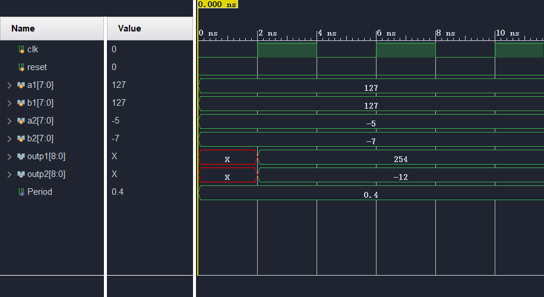
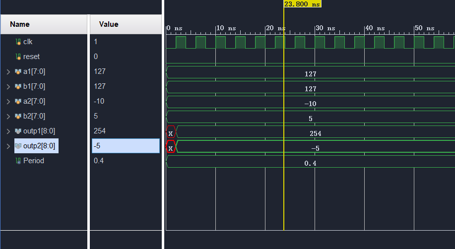
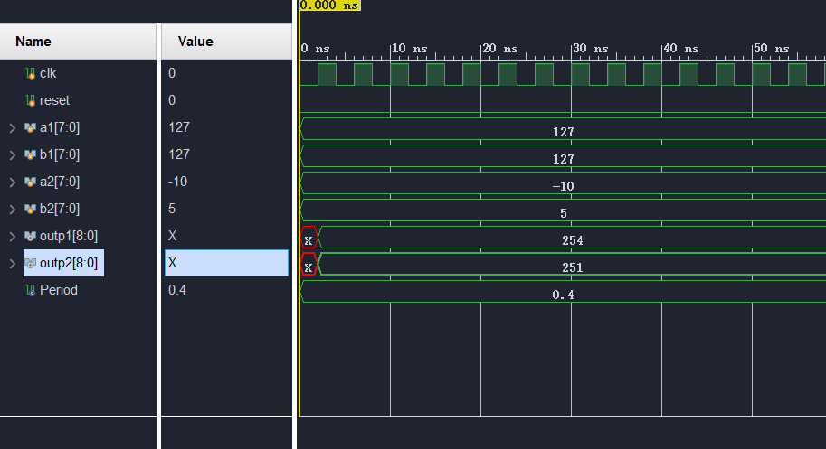

## Table of Contents

## 1 原码 & 反码 & 补码

原码是数字在计算机中的二进制表示形式，包括符号位和数值位。对于正数，原码与其真值（即十进制数）相同。对于负数，原码是其在补码表示下的反码再加1。

反码是原码的符号位除外，其余位取反。无论正负，反码都是原码的反转。

补码是反码再加1。对于正数，补码与原码相同；对于负数，补码是其在反码表示下的加1。

## 2 无符号 & 有符号数

在有符号数中，最高位（最左边的位）用作符号位，1表示负数，0表示正数。例如，一个8位的有符号整数可以表示范围为-128到127的整数。

无符号数则没有符号位，所有的二进制位都用于表示数值。无符号整数的取值范围通常是从0到2的n次方-1，其中n是二进制位的位数。例如，一个8位的无符号整数可以表示范围为0到255的整数。

## 3 加减法例程

无符号数计算需要注意进位：写代码时要注意进位，防止溢出。

```verilog
module unsign_plus(
    input clk,
    input [7:0] a,
    input [7:0] b,
    output reg[8:0] c
);

    // unsign plus
    always @(posedge clk) begin
        c <= a + b;
    end

    
endmodule //unsign_plus

```

有符号数计算需要注意复制符号位：要注意位宽问题，可能需要复制符号位.

```verilog
module sign_plus(
    input clk,
    input [7:0] a,
    input [7:0] b,
    output reg[8:0] c
);

    // sign plus
    always @(posedge clk) begin
        c <= {a[7], a} + {b[7], b};
    end
    
endmodule //sign_plus

```

TestBench代码：
```verilog
`timescale 10ns / 1ps

// ...

module test_calcu1();       // test bench

    parameter Period = 0.4; // Period
    reg clk;                // Simu Clock Signal
    reg reset;              // Reset all signal

    reg[7:0] a1;
    reg[7:0] b1;
    reg[7:0] a2;
    reg[7:0] b2;
    wire[8:0] outp1, outp2;
    unsign_plus up(
        .clk(clk), 
        .a(a1), 
        .b(b1), 
        .c(outp1));
    sign_plus sp(
        .clk(clk), 
        .a(a2), 
        .b(b2), 
        .c(outp2));

    // Generate clock signal
    always begin
        #(Period/2) clk = ~clk;
    end
    
    initial begin           // setup run
        clk = 0;
        reset = 0;

        repeat(100) begin
            @(posedge clk);
        end
    end

    initial begin           // test display
        a1 = 127;
        b1 = 127;
        a2 = -5;
        b2 = -7;
        $display("Hello world: %t!", $realtime);
    end

endmodule

```

例程输出：




对于位宽不同的加减法，需要注意复制符号位：

```
A: 8, B: 6, C: 8

C = A + {2{B[6]}, B}

```


## 4 Signed 关键字


在verilog中，有符号数可以加`signed`关键词来修饰，表示这个寄存器或变量是有符号数，没有加`signed`修饰，默认就是无符号数。修改模块如下：


```verilog
module test_calcu1();       // test bench

    // ...

    reg[7:0] a1;
    reg[7:0] b1;
    reg signed [7:0] a2;    // `signed`
    reg signed [7:0] b2;    // `signed`
    wire[8:0] outp1;
    wire signed [8:0] outp2;// `signed`

    // ...

    initial begin           // test display
        a1 = 127;
        b1 = 127;
        a2 = -10;
        b2 = 5;
        $display("Hello world: %t!", $realtime);
    end

endmodule

// ...

module sign_plus(
    input clk,
    input signed [7:0] a,           // `signed`
    input signed [7:0] b,           // `signed`
    output reg signed [8:0] c       // `signed`
);

    // sign plus
    always @(posedge clk) begin
        c <= a + b;
    end
    
endmodule //sign_plus

```

例程输出：




如果其中有`signed`和无`signed`混用则会计算错误：

```verilog
module sign_plus(
    input clk,
    input signed [7:0] a,           // `signed`
    input [7:0] b,                  // error
    output reg signed [8:0] c       // `signed`
);

    // sign plus
    always @(posedge clk) begin
        c <= a + b;
    end
    
endmodule //sign_plus

```

例程输出：



## 5 求绝对值

计算公式很简单，对于负数，取反加1，对于整数，取原值即可：

```verilog

module sign_abs(
    input clk,
    input signed [7:0] a,
    output reg a_sign,      // 1: negative, 0: positive 
    output reg[8:0] a_abs   // absolute value
);

    always @(posedge clk) begin
        a_sign <= a[7];
        a_abs <= a[7] ? (~a[6:0] + 1) : a[6:0];
    end

endmodule //sign_abs

```

根据符号位和绝对值，恢复原值，也很简单：负数取反加1，正数拓展高位0.

```verilog
module sign_abs_recover(
    input clk,
    input a_sign,      // 1: negative, 0: positive
    input [6:0] a_abs,  // absolute value
    output reg[7:0] a     // original value
);
    always @(posedge clk) begin
        a <= a_sign ? (~{1'b0, a_abs} + 1) : {1'b0, a_abs};
    end

endmodule //sign_abs_recover
```
