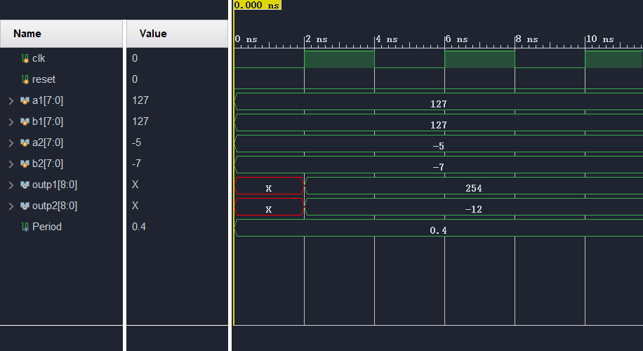

## Table of Contents

## 1 原码 & 反码 & 补码


## 2 无符号与有符号数


## 3 加减法例程

无符号数计算需要注意进位：写代码时要注意进位，防止溢出。

```verilog
module unsign_plus(
    input clk,
    input [7:0] a,
    input [7:0] b,
    output reg[8:0] c
);

    // unsign plus
    always @(posedge clk) begin
        c <= a + b;
    end

    
endmodule //unsign_plus

```

有符号数计算需要注意复制符号位：要注意位宽问题，可能需要复制符号位.

```verilog
module sign_plus(
    input clk,
    input [7:0] a,
    input [7:0] b,
    output reg[8:0] c
);

    // sign plus
    always @(posedge clk) begin
        c <= {a[7], a} + {b[7], b};
    end
    
endmodule //sign_plus

```

TestBench代码：
```verilog
`timescale 10ns / 1ps

// ...

module test_calcu1();       // test bench

    parameter Period = 0.4; // Period
    reg clk;                // Simu Clock Signal
    reg reset;              // Reset all signal

    reg[7:0] a1;
    reg[7:0] b1;
    reg[7:0] a2;
    reg[7:0] b2;
    wire[8:0] outp1, outp2;
    unsign_plus up(
        .clk(clk), 
        .a(a1), 
        .b(b1), 
        .c(outp1));
    sign_plus sp(
        .clk(clk), 
        .a(a2), 
        .b(b2), 
        .c(outp2));

    // Generate clock signal
    always begin
        #(Period/2) clk = ~clk;
    end
    
    initial begin           // setup run
        clk = 0;
        reset = 0;

        repeat(100) begin
            @(posedge clk);
        end
    end

    initial begin           // test display
        a1 = 127;
        b1 = 127;
        a2 = -5;
        b2 = -7;
        $display("Hello world: %t!", $realtime);
    end

endmodule

```

例程输出：




## 4 Signed 关键字

