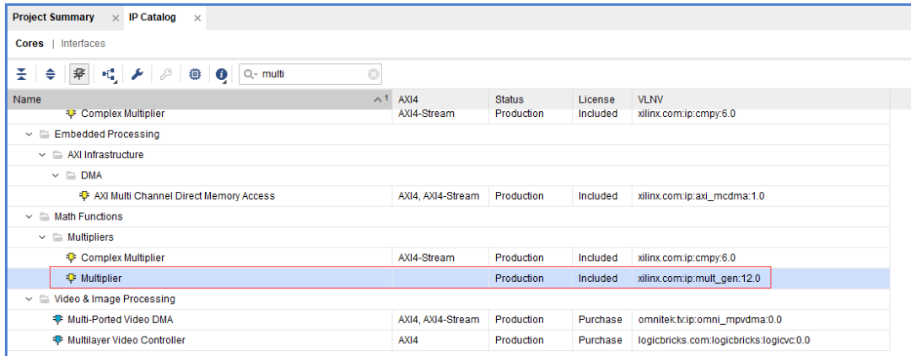
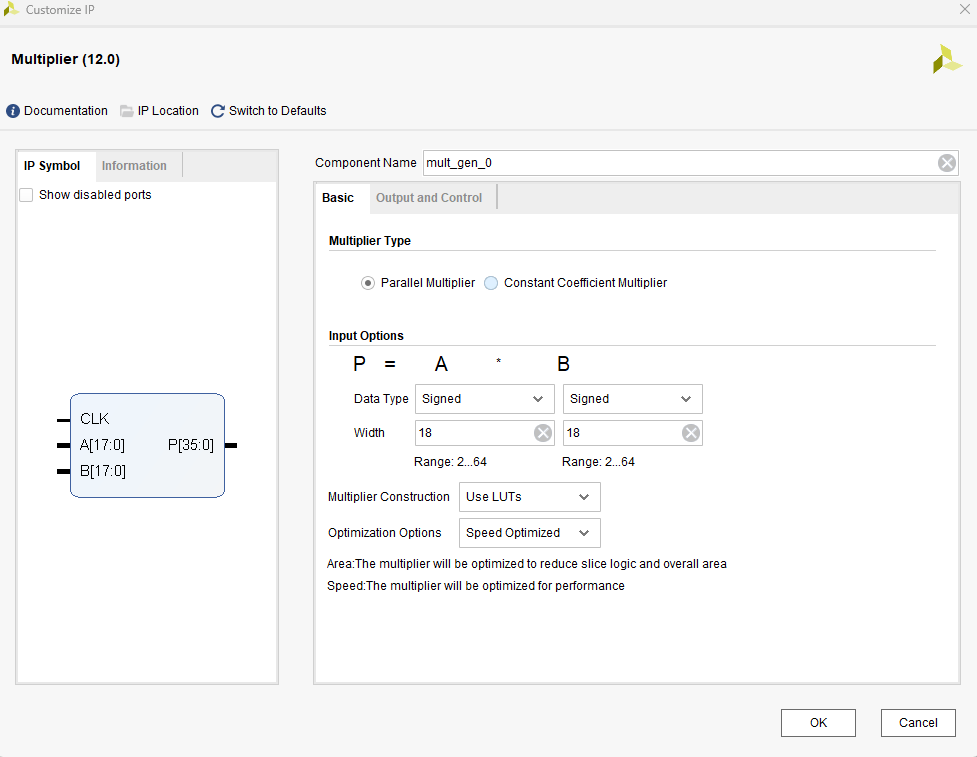
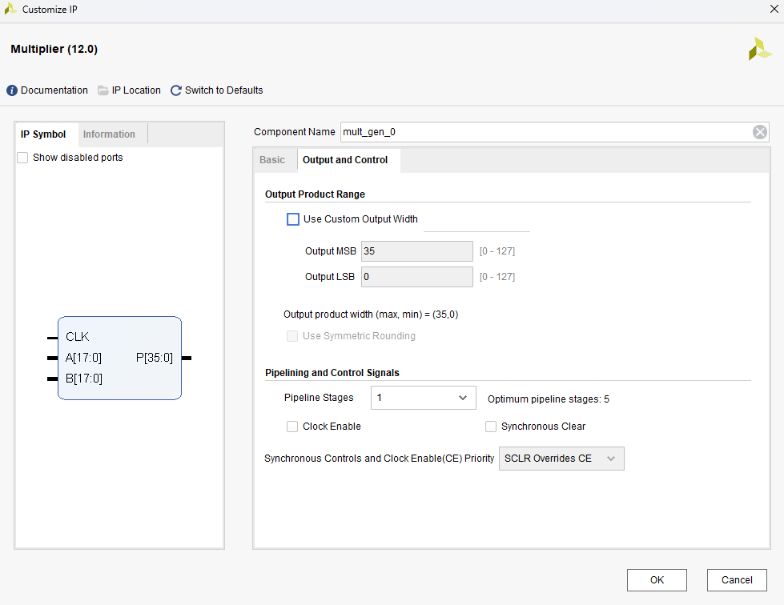

## Table of Contents

## 1 定点数 & 浮点数

### 1.1 定点数

定点数是小数点固定地（隐含）在数据的某一位置上。定点数根据小数点位置的不同可以分为：
1. 定点整数：小数点在整个数据除符号位外的最右边；
2. 纯小数：小数点在整个数据除符号位外的最左边；
3. 普通定点数：小数点在数据的中间某一位置。这时候需要约定小数点的位置；

```
    1. 定点整数：
    
        N0    |Nm ... ... N1| .
        ^sign  ^value         ^decimal point

        如：100(D) = + 01100100 [.0] (B)
    

    2. 纯小数：

        N0    .    |N(-1) ... ... N(-m)|
        ^sign ^dp   ^value    

        如：0.125(D) = + [0.] 00100000(B)
    

    3. 普通定点数，若1个字节数据约定前5bit为整数位，后3bit为小数位，则：

        1.5(D) = + 00001 [.] 100(B)
        25.125(D) = + 11001 [.] 001(B)

    小数计算：对于100，等于 2^(-1) * 1 + 2^(-2) * 0 + 2^(-3) * 0 。

```

> 定点数的应用：
> - 定点数在数字信号处理领域具有广泛应用，如定点F℉T(快速傅里叶变换)算法、定点卷积运算等；
> - 在控制系统中也常见到定点数的应用，如定点PD(比例-积分微分)控制器、定点状态观测器等。定点数可以简化计算，提高控制器性能；
> - 在数字图像处理中，各种图像算法，比如图像滤波、图像缩放等等。

### 1.2 浮点数

浮点数主要由尾数`M`和阶码`E`构成。例如基数为`2`的数`F`的浮点数表示为，其中：
1. 尾数`M`必须为小数，用`n+1`位有符号定点小数表示，可采用的原码，补码。
2. 阶码`E`必须为整数，用`k+1`位有符号定点整数表示，可采用原码，补码，移码。
3. 浮点数编码的总bit位数`m=(n+1)+(k+1)`。

```
    F = M * 2^F

```

常见的单精度和双精度浮点数是按照*IEEE-754*标准编码和解码的，该标准规定了浮点数的位数、指数和尾数的分配方式，具体格式如下图，尾数`M`用原码；阶码`E`用移码，基为2：
1. `S`：尾数符号，0正1负；
2. `M`：尾数，纯小数表示，小数点放在尾数域的最前面。采用原码表示；
3. `E`：阶码（指数），采用移码表示（移码可表示阶符）；阶符采用隐含方式，即采用移码方法来表示正负指数。

```
           | 31|30   23|22            1|
    32bit  | S |   E   |       M       |

           | 63|62        52|51               0|
    64bit  | S |     E      |        M         |

```

> 注意：
> 移码在补码的基础上，将符号位取反得到的，是其符号位用“1”表示正数，用“0”表示负数，数值部分与补码相同移码主要用于表示浮点数的阶码，其目的是使浮点数的机器零为全零。


## 2 浮点数与定点数转换

### 2.1 浮点数转整数

浮点数转整数的方法可以通过以下步骤实现：

1. 将浮点数乘以一个大的整数（例如乘以2的n次方），使得浮点数的小数部分转换为整数部分处理。
2. 进行整数运算，得到结果。
3. 如果需要保留小数部分，可以在得到的整数结果中取需要的位数作为小数部分。
4. 最终结果可以右移相应的位数，将结果还原为原始浮点数的精度。

这种方法可以提高浮点数运算的精度，特别适用于对浮点数进行乘法、除法等运算时需要保持较高精度的情况。

```verilog

reg [15:0] x; // 原始数据X，占用16位
reg [23:0] xm; // 将小数部分转换为整数处理后的中间变量Xm，占用24位
reg [15:0] y; // 最终结果y，占用16位

// 将小数部分转换为整数处理，乘以2^n，n为173的二进制表示的长度，即10
// 计算Xm = X * 173
Xm = X * 173;

// 将Xm的最高6位作为最终结果y的值
y = Xm[15:10];

```

### 2.2 浮点数转定点数

浮点数转定点数的方法可以通过以下步骤实现：

1. 约定整数位宽和小数位宽，例如整数位宽为n位，小数位宽为m位。
2. 将浮点数乘以2的m次方，即将小数部分转换为整数部分处理。
3. 进行整数运算，得到结果。
4. 如果需要保留小数部分，可以在得到的整数结果中取需要的位数作为小数部分。
5. 最终结果可以右移m位，将结果还原为原始浮点数的精度。

以下是Verilog代码示例：输入的浮点数为32位，输出的定点数整数位宽为3位，小数位宽为12位。根据约定的整数位宽和小数位宽，将浮点数乘以2的12次方，得到定点数。最终将得到的整数结果的最高15位作为整数部分，最低12位作为小数部分。

```verilog
module float_to_fixed (
    input wire [31:0] float_num, // 输入的浮点数，占用32位
    output reg [14:0] fixed_num // 输出的定点数，整数位宽3位，小数位宽12位
);

reg [31:0] fixed_temp; // 中间变量，存储将浮点数转换为定点数后的结果

// 将浮点数乘以2的12次方，即将小数部分转换为整数部分处理
assign fixed_temp = float_num << 12;

// 取得到的整数结果的最高15位作为整数部分，最低12位作为小数部分
assign fixed_num = fixed_temp[31:17];

endmodule
``` 


## 3 乘法操作

在 FPGA 中，乘法运算可以通过多种方法实现。

### 3.1 直接使用 `*`

直接在verilog代码中调用乘法符`*`，剩下的就让编译器自动判断和优化，决定最终是用LUT还是硬件乘法器DSP实现。

如果明确要求使用**硬件乘法器DSP**,则可以在寄存器变量声明前面，添加`(*use dsp48="yes"*)`,如下：

```verilog
wire [11:0] a, b;

(*use dsp48="yes"*) wire [23:0] c;

assign c = a * b;

```

> 注意事项：
> 1. 存储乘法运算结果的寄存器位宽，等于2个乘数的位宽，之和。
> 2. 建议乘法运算结果再打一拍，至少保持2个周期的延迟，改善代码时序，可兼容更高时钟频率下运行。

### 3.2 调用乘法器 IP `Mutiplier`

Xilinx乘法器 IP 支持有符号数和无符号数，也有两种资源消耗模式可选，一个是使用LUT,一个是使用硬件乘法器DSP。

> 注意：
> FPGA开发中，优先推荐使用DSP资源，如果DSP资源有限时，可考虑使用LUT资源实现，可以使用`Multiplier`这个IP,也可以考虑自己写。

1. 打开 IP：在vivado中打开IP库`IP Catalog`,选择`Multiplier`。



2. `Basic` 界面，配置参数：
   - `Multiplier Type`: Parallel Multiplier:并行乘法器、Constant Coefficient Multiplier:恒定系数乘法器。
   - `Input Options`: Data Type: Signed有符号数、Unsigned无符号数、Width: 操作数位宽。
   - Multiplier Construction: 使用LUT或乘法器DSP。
   - `Optimization Options`: Area Optimized资源优先或Speed Optimizedi速度优先。




3. `Output and Control` 输出控制界面：
   - `Output Product Range`: Use Custom Output Width:自定义输出宽度。
   - `Pipelining and Control Signals`: Pipeline Stages:流水线级数选择Clock Enable:时钟使能。
   - `Synchronous Clear`: 同步清除。
   - `SCLR/CE Priority`:设置SCLR引脚和CE引脚的优先级。




### 3.3 乘法器手动实现

**变量乘以常数**的方法`y = x * 83`如下：
1. 将常数分解为2的次幂和，将常数83分解为`64 + 16 + 2 + 1`；
2. 对于每一个常数分量，将变量左移对应的次幂；
3. 将所有左移后的结果相加，得到最终的乘法结果。

代码：

```verilog
// y = x * 83
module multiply_constant (
    input wire [7:0] x, // 输入变量x，8位
    output reg [15:0] y // 输出结果y，16位
);

reg [15:0] y_temp; // 中间变量，存储乘法结果的累加值

// 将常数83分解为2的次幂和：64+16+2+1
// 分别将x左移对应的次幂后求和得到结果y
always @* begin
    y_temp = (x << 6) + (x << 4) + (x << 1) + x;
end

assign y = y_temp; // 将中间变量赋值给输出结果y

endmodule

```

**变量乘以变量**的方法如下：

1. 对其中一个变量的每一位进行检查，如果该位为1，则将另一个变量左移相应的位数；
2. 将所有左移后的结果相加，得到最终的乘法结果。

在有符号数的情况下，建议先求绝对值，然后按无符号数乘法运算操作。这样可以简化处理过程，避免有符号数的符号位对乘法操作的影响。

以下是一个Verilog代码示例：输入变量var1和var2都是8位。根据var1的每一位是否为1，决定将var2左移相应的位数，然后将所有左移后的结果相加得到中间变量temp。最终将中间变量的值赋给输出结果result。

```verilog
// result = var1 * var2
module multiply_variable (
    input wire [7:0] var1, // 输入变量1，8位
    input wire [7:0] var2, // 输入变量2，8位
    output reg [15:0] result // 输出结果，16位
);

reg [15:0] temp; // 中间变量，存储乘法结果的累加值

always @* begin
    temp = 0; // 初始化中间变量为0
    for (int i = 0; i < 8; i = i + 1) begin
        if (var1[i] == 1) begin
            temp = temp + (var2 << i); // 如果var1的当前位为1，则将var2左移i位后加到temp中
        end
    end
end

assign result = temp; // 将中间变量赋值给输出结果

endmodule
```

## 4 除法操作

在 FPGA 数学运算中，除法运算因其特殊性，成为FPGA设计的重点和难点。


### 4.1 常数除法

当除数是常数时，可以通过将除数求倒数并左移，转换为整数，然后乘以被除数，最后将计算结果右移的方法来实现除法运算。这种方法称为**除法转换乘法**：
1. 将除数求倒数并左移N位，得到一个整数。
2. 将被除数乘以得到的整数。
3. 将乘法结果右移N位，得到最终的除法结果。

具有省资源、计算速度快的优点。选择合适的左移位数可以减小计算误差。

代码如下：被除数X为16位，根据常数34被分解为32和2，将X分别左移5位和1位，然后相加得到中间变量temp。最后将temp右移12位得到最终的除法结果Y。整个计算在时钟信号的上升沿触发。


```verilog
// y = x / 34
module division_constant (
    input wire clk, // 时钟信号
    input wire [15:0] X, // 被除数X，16位
    output reg [9:0] Y // 输出结果，10位
);

reg [15:0] temp; // 中间变量，存储乘法结果的累加值

always @(posedge clk) begin
    // 将X左移5位和1位，然后相加得到中间变量temp
    temp = (X << 5) + (X << 1);
    // 将中间变量temp右移12位得到最终结果Y
    Y <= temp >> 12;
end

endmodule
```

### 4.2 流水线实现除法器
流水线实现除法器的流程如下：
1. 取被除数的高N位数据，N与除数位宽一样。
2. 比较被除数高N位数据与除数，如果前者大于或等于后者，则商的对应位为1，将两者求差得到余数；否则将商对应位为0，将前者直接作为余数。
3. 将上一步的余数与被除数剩余最高位数据拼接成新的数据，重复进行第二步，直到被除数最低位数据也参与计算。

通过Verilog中的generate代码复制块，可以实现流水线的设计，加快除法器的运算速度。流水线实现除法器可以将除法过程分阶段进行，每个阶段处理一个部分，从而提高整体的运算效率。流水线设计可以有效地减少除法器的延迟，提高运算速度。

> 注意：
> 在Verilog中，可以利用`generate`块来复制模块实现流水线的设计。通过合理划分和设计各个阶段，可以实现高效的流水线除法器。

根据给定的模块接口，可以尝试实现一个除法器模块。在这个模块中，我们需要实现对被除数和除数的除法运算，并输出商和余数。Verilog代码实现：

```verilog
module divide #(
    parameter I_W = 32,
    parameter D_W = 9,
    parameter O_W = I_W - D_W
)(
    input wire clk,
    input wire reset,
    input wire valid_i, // 有效信号
    input wire [I_W-1:0] dividend, // 被除数
    input wire [D_W-1:0] divisor, // 除数
    output wire valid_o,
    output wire [O_W-1:0] quotient, // 商
    output wire [D_W-1:0] remainder // 余数
);

reg [I_W-1:0] dividend_reg; // 被除数寄存器
reg [O_W-1:0] quotient_reg; // 商寄存器
reg [D_W-1:0] remainder_reg; // 余数寄存器
reg [I_W-1:0] temp_dividend; // 临时被除数
reg [O_W-1:0] temp_quotient; // 临时商
reg [D_W-1:0] temp_remainder; // 临时余数

reg [3:0] state; // 状态寄存器
parameter IDLE = 2'b00, DIVIDE = 2'b01, DONE = 2'b10;

always @(posedge clk) begin
    if (reset) begin
        state <= IDLE;
        dividend_reg <= 0;
        quotient_reg <= 0;
        remainder_reg <= 0;
    end else begin
        case (state)
            IDLE: begin
                if (valid_i) begin
                    dividend_reg <= dividend;
                    state <= DIVIDE;
                end
            end
            DIVIDE: begin
                temp_dividend = {remainder_reg, dividend_reg};
                temp_quotient = 0;
                temp_remainder = 0;
                
                if (temp_dividend >= divisor) begin
                    temp_quotient = temp_dividend / divisor;
                    temp_remainder = temp_dividend % divisor;
                end
                
                quotient_reg <= temp_quotient;
                remainder_reg <= temp_remainder;
                
                valid_o <= 1;
                state <= DONE;
            end
            DONE: begin
                valid_o <= 0;
                state <= IDLE;
            end
        endcase
    end
end

assign quotient = quotient_reg;
assign remainder = remainder_reg;

endmodule
```

在这个Verilog代码示例中，我们实现了一个除法器模块，根据输入的被除数和除数进行除法运算，输出商和余数。模块包括状态机来控制除法的过程，根据状态机的状态进行相应的计算。通过寄存器来存储被除数、商和余数的值，并在每个时钟周期更新这些值。最终将计算得到的商和余数输出到相应的输出端口。

### 4.3 注意事项

在使用除法器时，可能会遇到以下几个问题和解决方案：

1. 当被除数数值很大且除数数值很小时，可能导致计算结果错误。解决方案是将除法器的“被除数位宽”设为被除数的实际位宽M加上除数位宽N减1。输入的被除数数据应为“(N-1)'b0, dividend”，这样可以确保计算结果的准确性。然而，这样做会增加除法器的资源消耗。

2. 如果除数B为常数，则可以将除法转换为乘法来计算。具体步骤包括：
   a. 将除数求倒数，再乘以左移N位（乘以2^N），转换为整数，即M=round(2^N/B)，其中round表示四舍五入处理。
   b. 进行乘法运算，D=A*M。
   c. 进行移位处理，C=(D+2^N-1)>>N，其中加上2^N-1是用于四舍五入处理。

3. 如果除数B是任意值，且值范围较小，可以在第2种情况的基础上，根据B的值，查表获取对应的值。例如，假设B为8位，则可以计算B从0到255时，对应的每一个M=round(2^N/B)，组成一个查表逻辑。这样可以针对不同的除数值进行优化计算，提高除法器的效率。

综上所述，针对除法器在处理大数值和小除数、常数除数以及任意值范围较小的情况下可能遇到的问题，可以采取不同的解决方案来优化除法运算的准确性和效率。通过合理设计和优化，可以提高除法器的性能和计算精度。