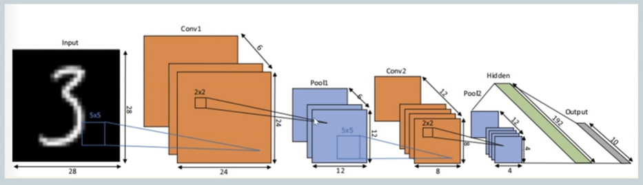
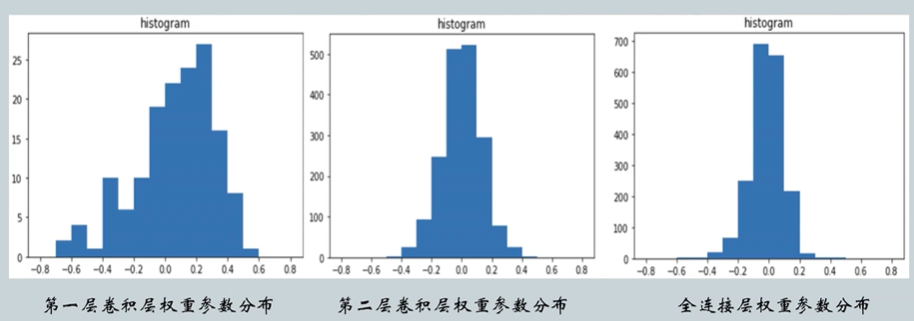
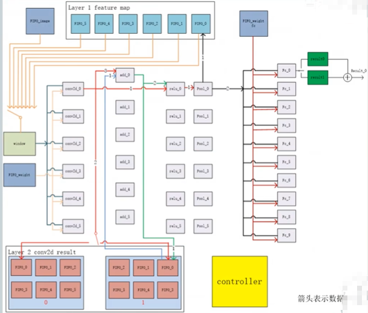
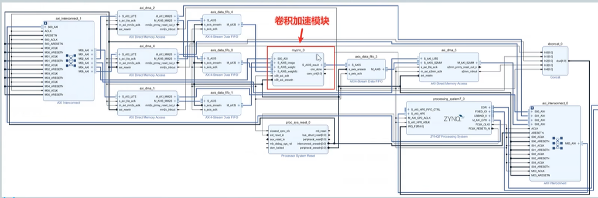
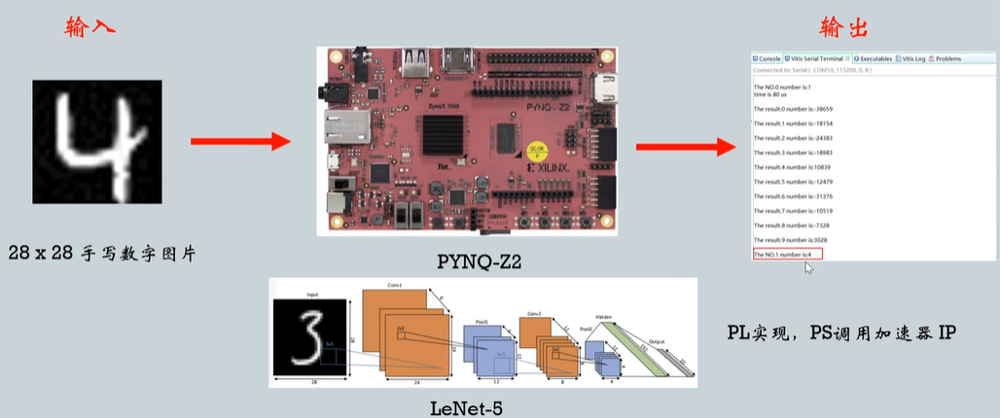
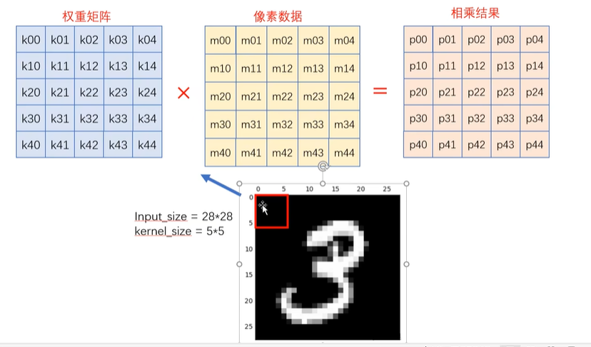
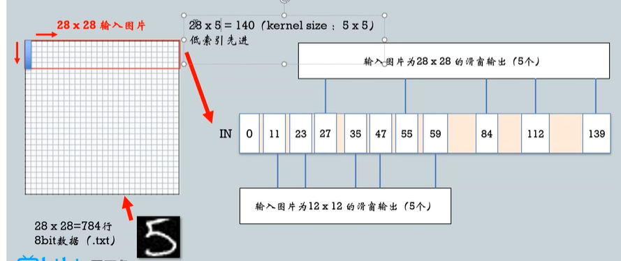

## fpga 加速手写体识别

### 1 理论准备

#### 1.1 数据

数据准备：28 * 28 手写体图片（LeNet-5）


  |Size  |Channel   |Layer|
  |:---:|:------:|:-----:|
  |28   |  1     |Conv5 |
  |24   |  6     |Pool2 |
  |12   |  6     |Conv5 |
  |8    |  12     |Pool2|
  |4    |  12     |  FC |
  |192  |  1      |Sel10 |
  |10   |  1     | End  |


#### 1.2 模型量化
`INT8`量化将每层权重映射到`-127~+127`之间，MAX-MAX映射将损失精度，先观察参数分布情况再选择映射方法：



#### 1.3 硬件加速器架构

1. 卷积部分并行度为6（由第一个卷积层通道数决定）；
2. 整个网络分为13次卷积循环（将第一层卷积`5*5*6*1`作为一次循环，第二层卷积`5*5*12*6`则有十二次）；
3. 权重参数为`3870=5*5*6*13+10*192`个参数不多，直接存储在BRAM，图片统一存储在SD卡内，通过DMA读取，传输到PL端的FIFO中，供加速器使用；
4. 全连接层没有复用（空间换时间）。



#### 1.4 顶层架构（PS+PL）

将卷积硬件加速器打包成IP，在Block Design中进行连接：
1. 通过三个S_AXIS接口从FIFO中接收图像像素数据、卷积层权重参数和全连接层权重参数。神经网络模型全部参数由DDR一次性全部传输到FIFO中；
2. PS端通过AXI-Lite接口写内部寄存器来控制卷积加速模块，接收到PL端FIFO通过DMA传来的10个32bit数据时，即一次卷积加速任务完成。卷积加速模块返回初始状态，但不释放缓存的1920个全连接层权重参数，等待PS端发出控制幸好开始下次加速任务。



#### 1.5 总览



### 2 滑窗模块设计

滑窗是卷积的基本结构：



#### 2.1 设计思路
移位RAM：



#### 2.2 设计实现

加速器模块：

```verilog

// 滑窗法：滑窗读取数据
// 用于给卷积模块剔红输入数据
module window(
    input   clk,
    input   rst_n,
    input   start,
    input   state,
    input   [7:0] data_in,
    output  [39:0] taps_out
);

    integer i;
    reg [7:0] mem [0:139];

    // 串行存储 140 个数据
    // 140 = 28 * 5
    // 每个上升沿由低位向高位移位一次
    always @(posedge clk or negedge rst_n) begin
        if(start) begin
            mem[0] <= data_in;
            for(i = 1; i < 139; i = i + 1) 
                mem[i + 1] <= mem[i];
        end
    end

    // state = 0 时：处理 28*28
    // state = 1 时：处理 12*12
    assign taps_out = (!state)?{mem[139],mem[111],mem[83],mem[55],mem[27]}:{mem[59],mem[47],mem[35],mem[23],mem[11]};

endmodule

```

TestBench：

```verilog
module window_tb();
    // 输入
    reg clk;
    reg rst_n;
    reg start_window;
    reg state;
    reg [7:0] img_in;
    // 输出
    wire [39:0] taps;

    // 文件指针
    integer fp_i;
    integer count_w;

    // 读入行数计数
    reg[10:0] cnt_line;

    // 滑窗例化
    window window_inst(
        .clk        (clk),
        .rst_n      (rst_n),
        .start      (start_window),
        .state      (state),
        .data_in    (img_in),
        .taps_out   (taps)
    );

    // 读取图片数据
    initial begin
        fp_i = $fopen("image.txt","r");
    end

    // 初始信号
    initial begin
        cnt_line = 0;
        clk = 0;
        start_window = 0;
        state = 0;
        # 20;
        start_window = 1;
    end

    always @(posedge clk) begin

    end

endmodule
```